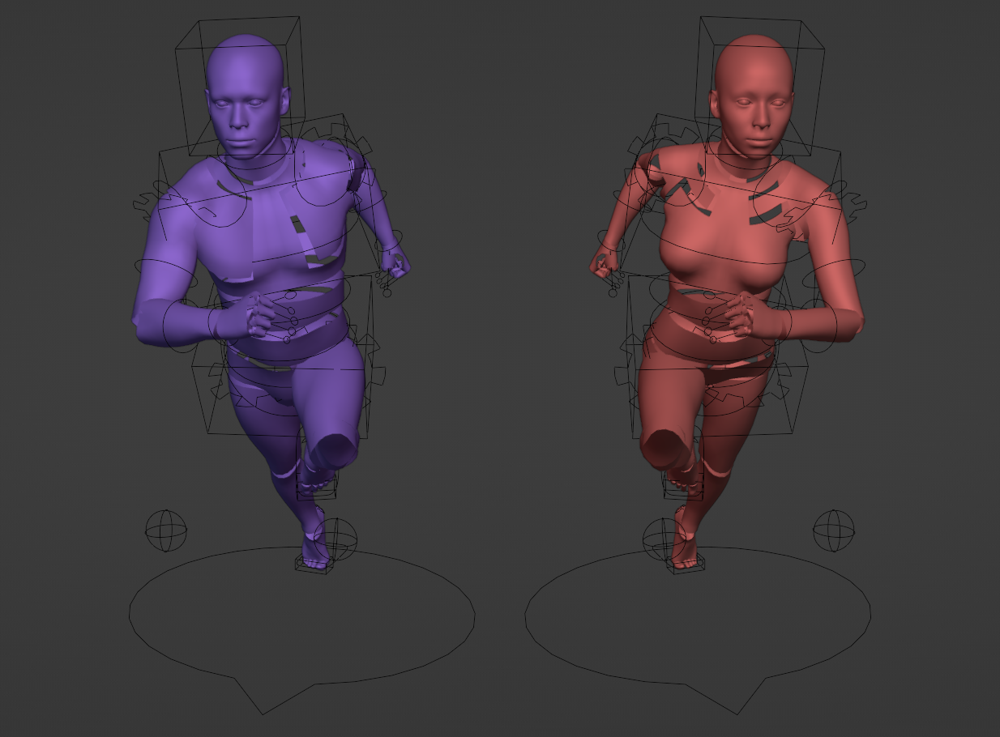

# Game Human Rig

This repository contains a .blend file of two prototyping rigged meshes that should be importable in Unity and Unreal.

I did not use Riggify for this because it provides a rig that is not directly usable in your usual game engine (though it can be converted with the help of an [addon](https://github.com/pKrime/Expy-Kit))

The mesh is a modified version of the male and female [Blender demo base mesh](https://www.blender.org/download/demo-files/)

Note that I am not a professional rigger/animator, so this rig can probably be improved in ways I don't know about. Feedback is appreciated!
